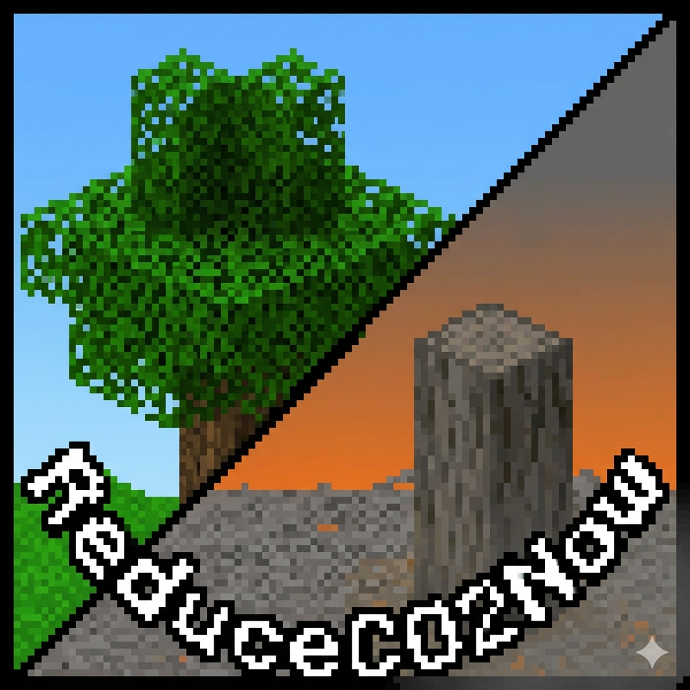

🌍 CO2 Reduce: Bedrock Edition

A Survival & Environmental Simulation Mod

📖 Overview

CO2 Reduce is a survival-focused mod built around the idea of making climate systems something you play through, not just read about.

The goal is simple: everything you do affects the atmosphere.

Mining, building, burning resources — it all adds up. Over time, the world reacts, and you have to deal with the consequences.

🛠️ Core Systems

🌫️ CO2 System (Global vs Potential)

Instead of a single CO2 value, the mod uses two:

Global CO2 (ppm)
This is the current level affecting the world (temperature, weather, hazards, etc.)
Potential CO2
Changes don’t apply instantly. They build up and slowly feed into the global level over about 20 minutes.

For example:

Planting trees creates a negative value (carbon absorption)
Industrial actions increase CO2 over time.

👁️ The Hunter

The Hunter is a persistent entity that reacts to how far things have gone.

At lower CO2 levels, it stays distant
As levels rise, it becomes more aggressive

Defeating it rewards journal entries that hint at what happened before — a version of the world that didn’t manage to fix things in time.

🔁 Environmental Changes

As CO2 increases, the environment starts to break down:

Canopy Mechanic
At high levels, the air becomes unsafe. Staying near leaf blocks keeps you alive, making forests important for survival.
Sea Level Rise
Water slowly spreads into lower areas.
Desertification & Fires
Grass can turn into sand, and wood can catch fire under extreme conditions.

🎮 Gameplay Features

HUD Display
Shows CO2 levels, temperature direction, and overall impact
Acid Rain
Damages players when exposed and slowly affects terrain
Starting Scenarios
Ice Age
Modern Day
Future
Multiple Endings
Your overall impact determines how things end.

📂 Project Structure

scripts/

├── config.js

├── co2System.js

├── hunterSystem.js

├── worldEffects.js

├── playerEffects.js

├── eventHandlers.js

└── main.js

📜 Development Notes

This project is meant to feel a bit heavier than a typical survival mod.

The idea isn’t just to simulate systems, but to make players deal with them directly — especially when things start going wrong.

🌱 Idea Behind It

If players can feel the impact of their actions in-game, they’re more likely to think about similar patterns outside the game.

That’s the core of the project.
